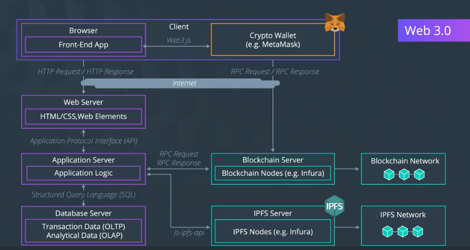

# Planning Blockchain Solutions

<figcaption>PCA9685 connections</figcaption>

## Unified Modeling Language (UML)

Types of UML

Class diagram: A structure that represents the components of a systems by illustrating the system's classes, attributes, operations, and how the objects may be connected.

Object diagram: A pectoral graph describing instances and their associated objects and data values.

State diagram: - Shows changes from one state to another and usually depicts the creation state and final states if there are any.

Activity diagram: - Flow of one activity to another in the system. Captures dynamic behavior of the system.

Sequence diagram: - Integration between objects in the sequence in which they take place.

### Tools to create  UML Diagrams.

<a href = "https://www.lucidchart.com/pages/">Lucidchart</a>

<a href = "https://app.diagrams.net/">draw.io</a>