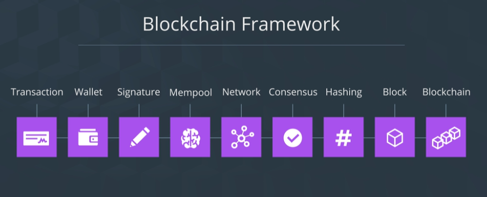
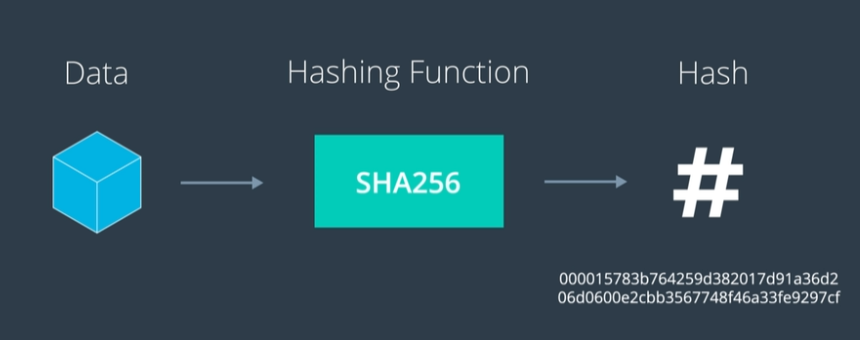

Many of the concepts that Nakamoto wrote about - from building in privacy to ensuring the system grows - extend beyond Bitcoin and even beyond just cryptocurrency. These are concepts that are fundamental to building a robust blockchain for any application.

<a href = "https://bitcoin.org/bitcoin.pdf">Bitcoin: A Peer to Peer Electronic Cash System</a>

<figcaption>Blockchain oveview</figcaption>

<figcaption>Hashing</figcaption>

Run scripts for ...

### Concepts

docker build -t hashapp .
Docker run --rm -ti hashapp sh

good documentation to run <a href = "https://stackoverflow.com/questions/48001082/oci-runtime-exec-failed-exec-failed-executable-file-not-found-in-path">docker bash</a>
