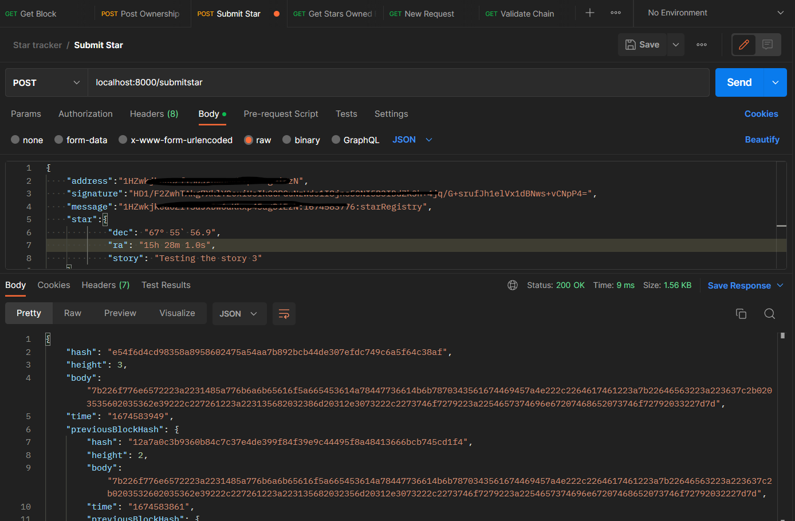
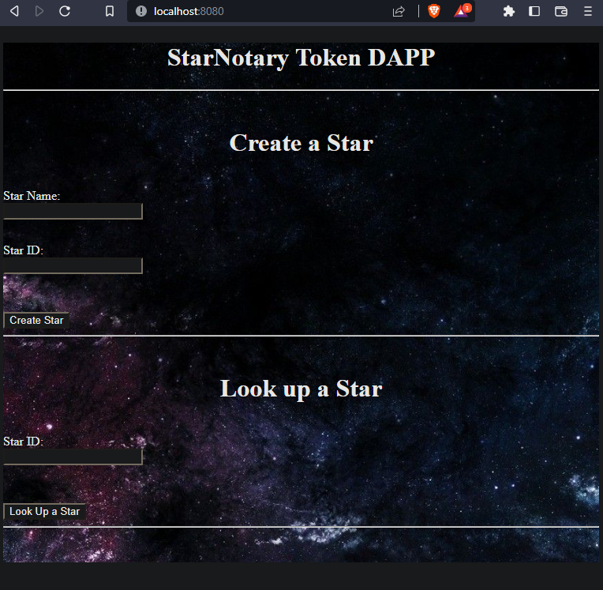
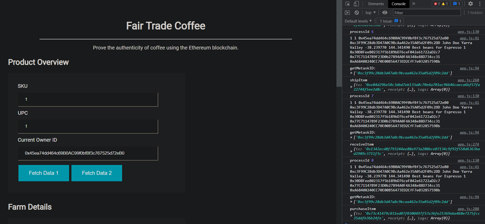
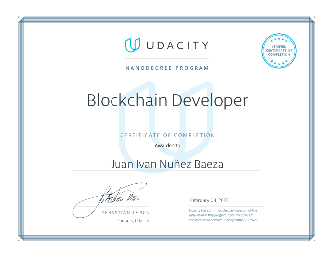

# Blockchain_Dev_Nanodegree.

<a href = "https://github.com/udacity/nd1309-work-code">Nanodegree Github Repository</a>

Code and projects from the Udacity nanodegree Blockchain developer

# Reference.

<a href = "https://bitcoin.org/bitcoin.pdf">Bitcoin: A Peer to Peer Electronic Cash System</a>

<a href = "https://docs.soliditylang.org/en/v0.4.21/types.html">Types</a> Solidity is a statically typed language, which means that the type of each variable (state and local) needs to be specified.

<a href="https://ethereum.org/en/">ethereum.org</a>

<a href="https://etherscan.io/">Etherscan:</a> Block explorer used to search Ethereum analytics. 

<a href="https://metamask.io/">Metamask:</a> Browser based plug-in that allows you to carry out Ethereum transactions. 

<a href="https://remix.ethereum.org/#optimize=false&runs=200&evmVersion=null&version=soljson-v0.8.7+commit.e28d00a7.js">Remix IDE:</a> A browser based IDE that allows you to write Solidity and deploy solidity contracts. 

<a href="https://web3js.readthedocs.io/en/v1.7.5/">web3.js:</a> A collection of libraries that allow you to interact with a local or remote Ethereum node. 

<a href="https://infura.io/">INFURA:</a> It allows you to connect to the Ethereum blockchain without running a full node. It's a lightweight alternative to downloading the entire blockchain to your local device. It makes the connection that allows you to use the functionality provided by web3. 

<a href="https://trufflesuite.com/ganache/">Ganache:</a> This tool allows you to set up your own local blockchain. It comes preloaded with 10 accounts, each containing 100 ether. This gives you a way to make test transactions between many accounts without needing to worry about stocking up on test ether or paying for real ether.

<a href="https://trufflesuite.com">TRUFFLE:</a> A development environment, testing framework, and asset pipeline meant to make your life easier as an Ethereum developer. 

<a href="https://geth.ethereum.org/">geth:</a> A golang implementation of the Ethereum blockchain used to set up a local full Ethereum node. 

<a href="https://ethstats.net/">Ethstats:</a> Here you can check out some of the current data about the Ethereum network.
 
 

# Projects.

1.- <a href = "https://github.com/juan-ivan-NV/1_Udacity_Private_Blockchain">Private Blockchain App.</a>

* An application that allows many users to register stars, and track the ownership of each star.

  

2.- <a href = "https://github.com/juan-ivan-NV/Decentralized_Star_Notary_Service_Project">Decentralized Star Notary Service Project.</a>

* Project to register, sale and buy stars on a blockchain app (with UI and a transaction done on a test network).

  

3.- <a href = "https://github.com/juan-ivan-NV/ETH-Dapp-tracking-items-through-supply-chain">ETH Dapp Tracking Items Through Supply Chain.</a>

* ETH DAPP that shows the flow of a coffee business through the different roles, from a Farmer to a Consumer.

  

4.- <a href = "https://github.com/juan-ivan-NV/Flight-Surety-Dapp-BC">Flight Surety Dapp.</a>

Application project for Udacity's Blockchain course.

* That repository contains Smart Contract code in Solidity (using Truffle), tests (also using Truffle), dApp scaffolding (using HTML, CSS and JS) and server app scaffolding

  

------------------------------------------------------------------------------
# Certificate.

